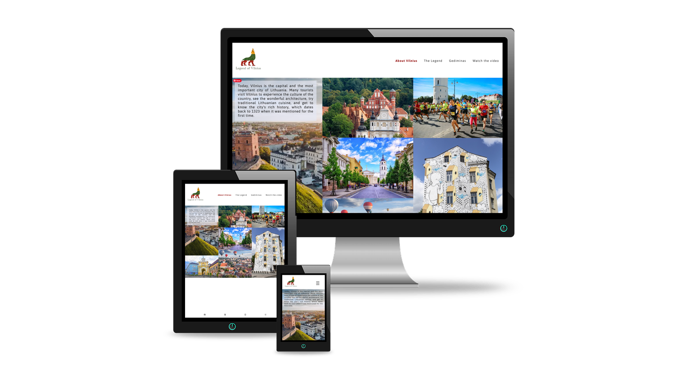
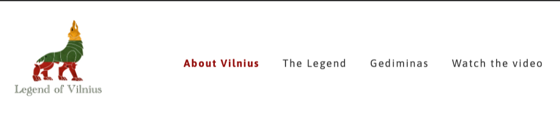
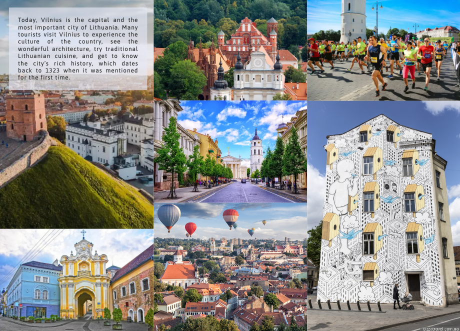

# The Legend of Vilnius

This website is dedicated to the legend of Vilnius city foundation. It aims to educate more people about a beautiful tale that is known to every Lithuanian. Apart from having the legend written down, there is also an embedded video for those who want to watch. A separate page gives an information who is Gediminas, the main character of the legend.

Find the live site [here]

[here]: https://flowercatgirl.github.io/firstAssignment/index.html

## Features

### Navigation

- Featured at the top of the page, the navigation shows the website logo in the left corner, that links to an index.html page

- The other navigation links are to the right: About Vilnius, The Legend, Gediminas, Watch the video

- The navigation bar is responsive: the tabs are not visible on the mobile until the user clicks on the hamburger icon, and fully visible on bigger screens

- It clearly tells what the website is about, it is simple, clean and effective

- The active page has it's navigation tab in red and bold

## About Vilnius

- The index page of the website. It shows the gallery of Vilnius photos as well as educating the user about the city

- The gallery is responsive: it shows only 1 column on the mobile and 3 on bigger screens

- The text about Vilnius is located on top of the gallery and is readable

