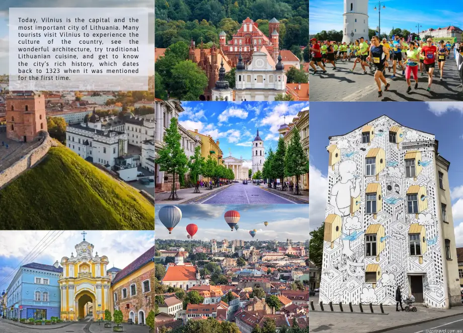

# The Legend of Vilnius

This website is dedicated to the legend of Vilnius city foundation. It aims to educate more people about a beautiful tale that is known to every Lithuanian. Apart from having the legend written down, there is also an embedded video for those who want to watch. A separate page gives an information who is Gediminas, the main character of the legend.

Find the live site [here]

[here]: https://flowercatgirl.github.io/firstAssignment/index.html

---

## Features

### Navigation

- Featured at the top of the page, the navigation shows the website logo in the left corner, that links to an index.html page

- The other navigation links are to the right: About Vilnius, The Legend, Gediminas, Watch the video

- The navigation bar is responsive: the tabs are not visible on the mobile until the user clicks on the hamburger icon, and fully visible on bigger screens

- It clearly tells what the website is about, it is simple, clean and effective

- The active page has it's navigation tab in red and bold

### About Vilnius

- The index page of the website. It shows the gallery of Vilnius photos as well as educating the user about the city

- The gallery is responsive: it shows only 1 column on the mobile, 2 on smaller tablets and 3 on bigger screens

- The text about Vilnius is located on top of the gallery and is readable

### The Legend

- The Legend page has the legend text itself

- The page is responsive on many different screens: it has a legend image as a background and the text is located as a top layer. Whenever the text can become hard to read it's background turns darker

### Gediminas

- Information on the main character of the legend, who he was for Lithuania

- The page is responsive, image and the text formated differently for small and big screens

### Watch the video

- This page has an embedded youtube video, it is responsive for any screen size

- Users, that prefer to see the film instead of reading the legend can do that for a better experience

### Footer

- Has 4 social media icon links, all working

- Responsive

### Future Implementations

- It would be nice to redo every page of the website with more meaningful text and pictures

- Another page can be added with a form to fill with a suggestions how to make this website better

---

## Accessibility

I have been mindful during coding to ensure that the website is as accessible friendly as possible. I have achieved this by:

- Using semantic HTML.

- Using descriptive alt attributes on images on the site.

- Ensuring that there is a sufficient colour contrast throughout the site.

- Ensuring that all sections of the navigation are easily accessible at all times by making the header navbar stick to the top of the page while users scroll.

---

## Technologies Used

### Languages Used

- HTML5 and CSS only

### Frameworks, Libraries & Programs Used

-  Git - For version control.

- Github - To save and store the files for the website.

- Google Fonts - To import the fonts used on the website.

- Font Awesome - For the iconography on the website.

- [Favicon.io](https://favicon.io/) To create favicon.

- Google Dev Tools - To troubleshoot and test features, solve issues with responsiveness and styling.

- Photoshop - To cut and compress images.

- [Cloudconvert](https://cloudconvert.com) To convert images to webp format.

- [Tinypng](https://tinypng.com/) To compress webp images.

- [Am I Responsive?](http://ami.responsivedesign.is/) To show the website image on a range of devices.

- Google Chrome extensions:
   Responsive Image Linter - To optimise image sizing.
   Better ruler - To check the size of a whitespace in the gallery in order to fill it.
   Lighthouse Report Viewer - to check the performance of the site.

---

## Deployment & Local Development

### Deployment

Github Pages was used to deploy the live website. The instructions to achieve this are below:

- Log in (or sign up) to Github

- Find the repository for this project, firstAssignment

- Click on the Settings link

- Click on the Pages link in the left hand side navigation bar

- In the Source section, choose main from the drop down select branch menu. Select Root from the drop down select folder menu

- Click Save. Your live Github Pages site is now deployed at the URL shown

### Local Development

#### How to Fork

To fork the firstAssignment repository:

- Log in (or sign up) to Github

- Go to the repository for this project, Flowercatgirl/firstAssignment

- Click the Fork button in the top right corner.

#### How to Clone

To clone the repository:

- Log in (or sign up) to GitHub

- Go to the repository for this project, Flowercatgirl/firstAssignment

- Click on the code button, select whether you would like to clone with HTTPS, SSH or GitHub CLI and copy the link shown

- Open the terminal in your code editor and change the current working directory to the location you want to use for the cloned directory

- Type 'git clone' into the terminal and then paste the link you copied. Press enter

___

## Testing

Testing was ongoing throughout the entire build of the website. I used mostly Chrome Developer Tools, but also Lighthouse report viewer at the end.

### W3C Validator

[Index Page HTML](assets/testing/index.webp)

[The Legend Page HTML](assets/testing/legend_page.webp)

[Gediminas Page HTML](assets/testing/gediminas.webp)

[Watch the video Page HTML](assets/testing/watch_thevideo.webp)

[CSS](assets/testing/css.webp)

### Lighthouse validator

[Screenshot of a site validator](assets/testing/validator.webp)

### Solved Bugs

1. Index.html page had no hidden heading within a section element.
I solved this one with a help of a testing video from a love running project.

2. Legend page had multiple paragraph elements within a heading one. 
I googled and found out that paragraphs are not meant to be used within a heading, I should treat it like a written page where you have the heading and paragraphs go after it. To style them I better use the class element.

3. When I copied an iframe to embed the youtube video on my site it had a frameborder attribute that is not supported anymore. I found the solution on stackoverflow how to get rid of it without compromising an iframe code.
The solution was to get rid of a frameborder and use border: 0px instead.

4. I needed to resize my webp images a few time to improve the performance.

### Known Bugs

No known bugs at the moment.

### Full Testing

To fully test my website I performed the following testing using a number of browsers (Chrome, Safari, Mozilla Firefox, Duckduckgo) and devices ( Macbook Pro 16", iPhone 14 plus).

I also viewed both pages in Chrome developer tools to ensure they were responsive on all screen sizes.

#### Links

-  Test each link on each page. Each link worked as expected, and any links leading to external pages opened correctly in a seperate browser tab.

___

## Credits 

### Code used

Burger menu, gallery and footer code used was taken from Love Running Project.

Solution how to fix the outdated frameborder was taken from [Stackoverflow](https://stackoverflow.com/questions/26274082/the-frameborder-attribute-on-the-iframe-element-is-obsolete-use-css-instead)

## Content 

Text content taken from 

[Culture Trip](https://theculturetrip.com/europe/lithuania/articles/gediminas-dream-the-legend-of-vilnius)

and

[Parsifal](https://parsifal.pixel-online.org/legend_view.php?id_legend=MTA=&ref=lithuania)

Both sites were used only for learning purposes

## Media

Video embedded from [Youtube](https://www.youtube.com/watch?v=pAoJGytFbhY)

Images were taken from multiple sites:

[1](https://www.spreadshirt.ie/shop/design/lietuva+iron+wolf+mens+sport+t-shirt-D5fa430adfcfbe36ede004d2b?sellable=xrvMXOZzVrtyEEZegB98-977-7&view=D1)

[2](https://www.thetimes.co.uk/article/a-weekend-break-in-vilnius-lithuania-weird-but-absolutely-wonderful-0cjt7hvkh)

[3](https://www.govilnius.lt/visit-vilnius/places/most-loved-places)

[4](https://www.expedia.co.uk/stories/how-to-spend-48-hours-in-vilnius-lithuania/)

[5](https://www.nordicexperience.com/tours/vilnius-tours/vilnius-old-town-walking-tour/)

[6](https://raceraves.com/races/vilnius-half-marathon/)

[7](https://www.pizzatravel.com.ua/eng/lithuania/83/vilnius)

[8](http://www.levoriskis.com/fotodrobiu-galerija/vilniaus-700-asis-gimtadienis/didysis-kunigaikstis-gediminas)

All the Media used only for learning purposes

